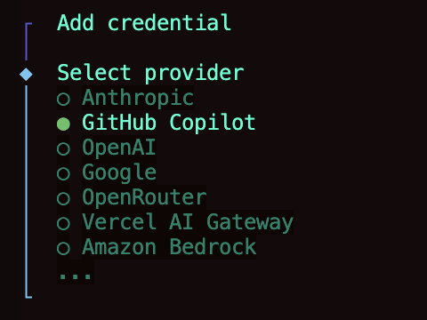

# OpenCode CLI

## GitHub Copilot Login

To login to GitHub Copilot using the opencode CLI:

```bash
opencode auth login
```

- Select Github Copilot



This command will:

1. Open your default web browser
2. Redirect you to GitHub's device activation page
3. Prompt you to enter a device code
4. Complete the authentication flow with your GitHub account

After successful authentication, you'll be able to use GitHub Copilot models through the opencode CLI.

## Verify Authentication

To verify your authentication status:

```bash
opencode auth status
```

## Available Copilot Models

Once authenticated, you can use these Copilot models:

- `copilot` - Standard GitHub Copilot model
- `copilot-chat` - GitHub Copilot Chat model

## Usage Example

```bash
opencode --model copilot "Explain this function"
```
